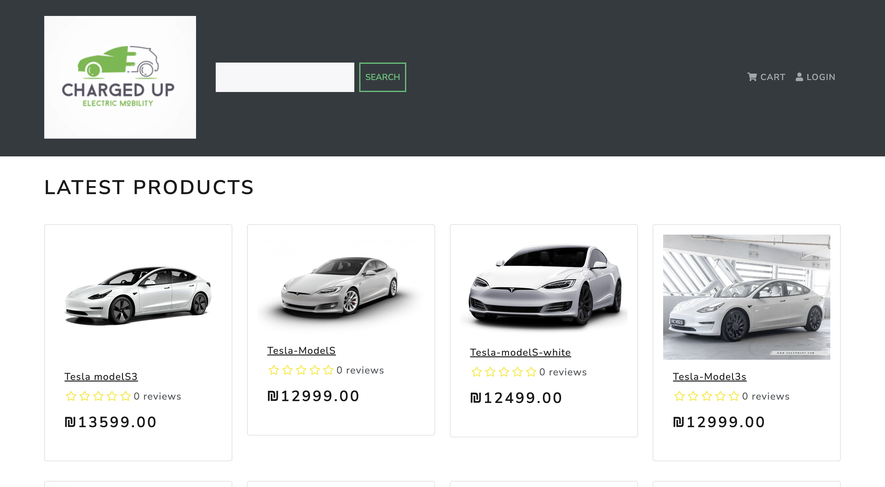
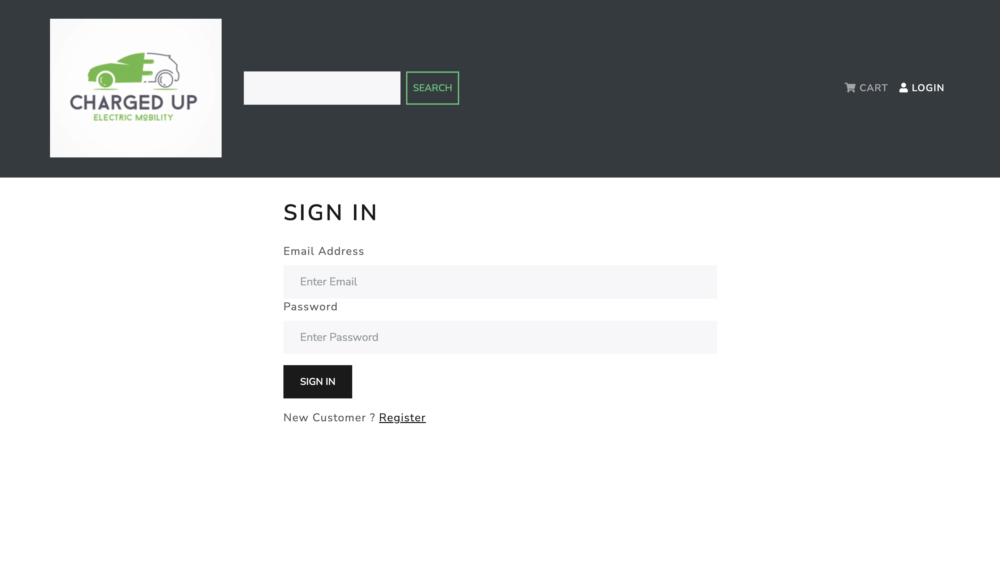
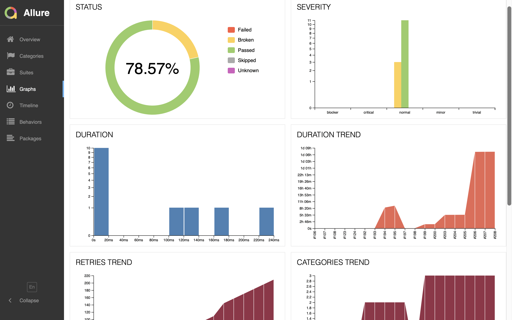
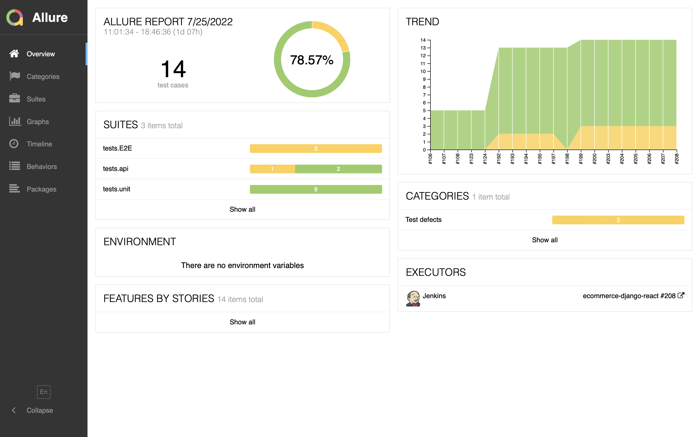

<h1 align=center>E-Commerce Website with Django + React & Redux</h1>
<h2 align=center>Otaku House - Anime Merchandise and Cosplay Shop</h2>

## ✨ [Automation Testing System On Live Link](https://localhost:8000.com/)

### How to Run 🏃 on Mac - Linux 💻 / Windows 🖥 
```shell
1 Clone This Repo
2 python3 -m venv env
3 .\env\Scripts\activate
4 pip install -r requirements.txt
5 python manage.py runserver 🖥 python3 manage.py runserver 💻 
```
### Run Tests &Build a version on Mac - Linux 💻 and Windows 🖥 
```shell
1 be sure Jenkins & Docker is running on
2 open Jenkins local page -> create new pipeline project 
3 copy & paste the groovy code from jenkins script file on the repo
4 click on Build Now button from the project page 
```
### 📷 Project Screenshots







### 🚀 Project Features

A completely automation testing eCommerce website, starting from unit test until opennign issue at Jira
- Using 3 types of testing (Unit/API/E2E)
- In case of changes on Github all scenario will executed
- starting from Unit testing then api
- then creating image and running container with docker
- running end to end tests on that image
- recording reports
- in case of tests fails opening issue on Jira

